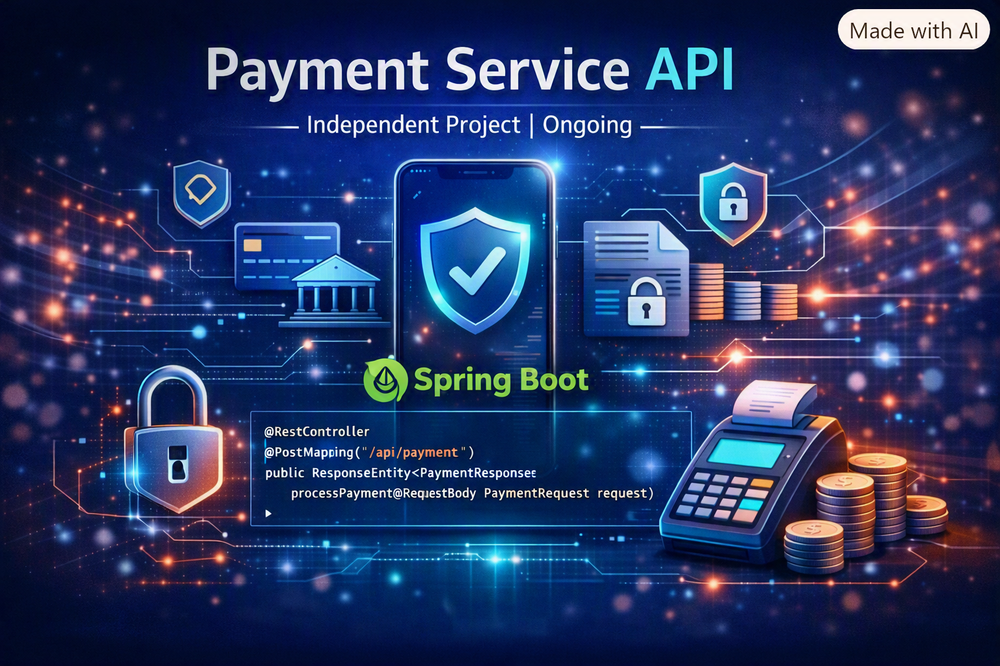

# Payment Service API

A Spring Boot–based microservice for managing accounts and processing payments.  
This service provides full CRUD operations for accounts and transactions, along with health and diagnostics endpoints.

---

## 🚀 Features
- **Payments**
  - Transfer funds between accounts
  - View all transactions
  - Delete transactions (for cleanup/testing)

- **Accounts**
  - Create new accounts
  - Retrieve account details by ID
  - List all accounts
  - Update accounts (PUT)
  - Patch accounts (partial updates)
  - Delete accounts (for cleanup/testing)

- **Diagnostics**
  - Health check endpoint
  - Actuator info for build/version metadata

---

## 📦 Tech Stack
- **Java 17+**
- **Spring Boot**
- **Maven**
- **Postman** (for API testing)

---

## ⚙️ Setup & Run
1. Clone the repository:
   ```bash
   git clone https://github.com/your-username/payment-service.git
   cd payment-service

mvn spring-boot:run


Service will start on:

http://localhost:8080

```

---

## 🔑 Authentication
All endpoints require Basic Auth.
Credentials are encoded in Base64 and passed via the Authorization header.

Example:
```bash
Authorization: Basic <encoded-credentials>

```

---

## 📖 API Endpoints
### Payments
POST /api/payments/transfer → Transfer funds

GET /api/payments/transactions → List all transactions

DELETE /api/payments/transactions/{id} → Delete transaction by ID

### Accounts
POST /api/accounts → Create new account

GET /api/accounts/{id} → Get account by ID

GET /api/accounts → List all accounts

PUT /api/accounts/{id} → Update account

PATCH /api/accounts/{id} → Partially update account

DELETE /api/accounts/{id} → Delete account

### Diagnostics
GET /api/health → Service health check

GET /actuator/info → Build/version metadata

---

## 🧪 Testing with Postman
A ready‑made Postman collection is included:
payment-service.postman_collection.json

Steps:
Import the collection into Postman.

Set up environment variables:

baseUrl → http://localhost:8080

authHeader → Basic <encoded-credentials>

Run Health Check first to confirm the service is running.

Use the other requests to test payments and accounts end‑to‑end.

---

## 📌 Notes
Delete endpoints are intended for testing/cleanup only.

In production, accounts should be marked as inactive instead of hard‑deleted.

Transactions form part of the audit trail and should not be removed in real systems.

---

## 🛠 Future Enhancements
Add /actuator/metrics for runtime monitoring

Integrate with external payment gateways

Implement JWT‑based authentication for stronger security

---

## 👨‍💻 Author
Developed by Leonard Phokane
Cloud‑Native & DevOps Engineer | Backend AI/ML Engineering Intern | Freelance Full‑Stack Developer